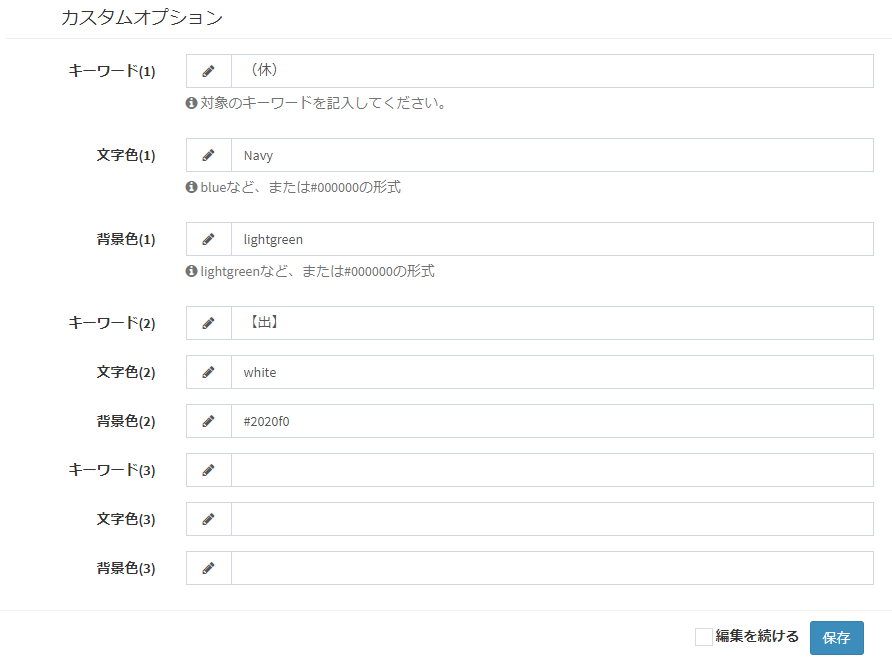
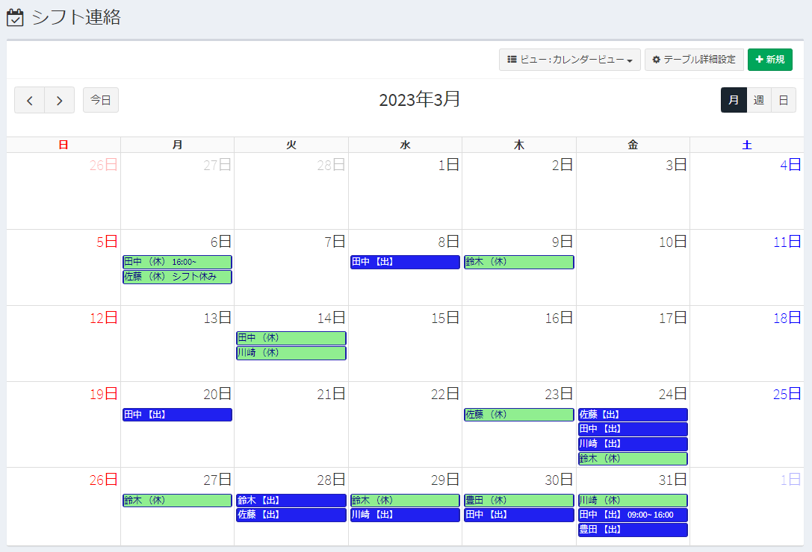

# Exment用プラグイン カレンダービューCSSカスタム - CalViewCustom
カレンダービューにおいて、特定文字列を含む項目のスタイルシートを変更するプラグインです。
最大で3つのキーワードに対応しています。

## 実行方法
- プラグインをインストールします。

- 該当プラグインの管理ページで、使用する対象テーブルなどの設定を行います。

- 実施トリガーは「画面読み込み前」としてください。

- 説明に従ってカスタムオプションを適宜設定します。  

- 対象テーブルのカレンダービューで適用されているか確認します。

   

   

## 補足
本プラグインは、イベントトリガーで、追加のCSSファイル(public/style.css)生成、更新して、スタイルプラグインでそれを読み込ませる処理で実現しています。

## 動作確認をしたバージョン
Exment v5.0.6
